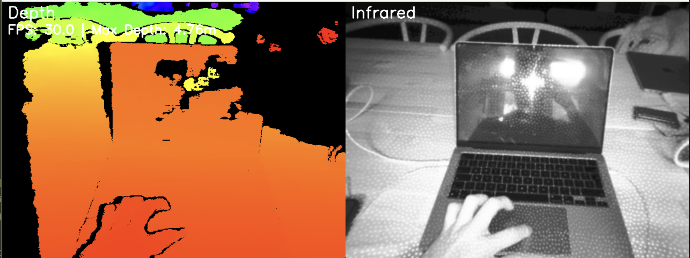

# RealSense Apple Silicon

This repository contains implementations for using Intel RealSense cameras on Apple Silicon Macs:

1. A Python wrapper using Cython
2. A C++ test application

## Example Output


## Repository Structure

```
realsense_applesilicon/
├── realsense_python/       # Python package
│   ├── src/               # Source code
│   │   └── realsense/    # Python module
│   ├── tests/            # Python tests
│   ├── examples/         # Example scripts
│   └── docs/             # Documentation
├── cpp_test/             # C++ test application
│   ├── CMakeLists.txt
│   └── realsense_test.cpp
└── README.md
```

## Python Package

The Python package provides a Cython-based wrapper for the RealSense SDK, optimized for Apple Silicon.

### Installation

1. Install the Intel RealSense SDK 2.0:
```bash
brew install librealsense
```

2. Install the Python package:
```bash
cd realsense_python
python -m venv venv
source venv/bin/activate
pip install -e .
```

### Usage

```python
from realsense import PyRealSense

# Initialize camera
camera = PyRealSense()

# Start the camera
camera.start()

try:
    while True:
        # Get depth and IR frames
        depth_frame, ir_frame = camera.get_frames()
        
        # Process frames (example with OpenCV)
        cv2.imshow('Depth', depth_frame)
        cv2.imshow('IR', ir_frame)
        
        if cv2.waitKey(1) & 0xFF == ord('q'):
            break
finally:
    camera.stop()
```

## C++ Test Application

A standalone C++ application for testing RealSense camera functionality.

### Building

```bash
cd cpp_test
mkdir build && cd build
cmake ..
make
```

### Running

```bash
./realsense_test
```

## Development

### Python Development

```bash
cd realsense_python
python -m venv venv
source venv/bin/activate
pip install -e .
```

Run tests:
```bash
python tests/test_realsense.py
```

### C++ Development

```bash
cd cpp_test
mkdir build && cd build
cmake ..
make
./realsense_test
```

## License

MIT License 